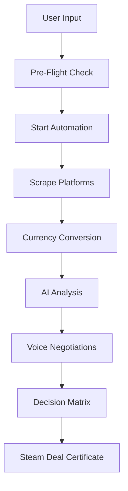

# 🚀 IndiaMART Sniper - Autonomous Global Sourcing Agent

> The world's first AI-powered autonomous sourcing agent that transforms B2B procurement from a manual process into an intelligent, automated workflow.


## 🎯 Project Overview

IndiaMART Sniper automates the entire B2B sourcing process—from searching multiple platforms to negotiating with vendors via AI voice calls. It finds the "Steam Deal" (absolute best market price) without requiring any manual intervention.

### ✨ Key Features

- 🤖 **AI-Powered Interview**: Natural language interface to capture sourcing requirements
- 🔍 **Multi-Platform Scraping**: Searches IndiaMart, Alibaba, TradeIndia simultaneously
- 💱 **Auto Currency Conversion**: Converts all prices to INR in real-time
- 📞 **Hinglish Voice AI**: Automated vendor negotiations in Hindi + English
- 📧 **Design File Distribution**: Automatically emails design files to vendors
- 📊 **Decision Matrix**: Categorizes vendors by Price, Reviews, Speed, and Service
- 🎓 **Steam Deal Certificate**: Downloadable proof of best market price
- 🌑 **Premium Dark UI**: Glassmorphism aesthetic inspired by ElevenLabs
- ⚡ **Comet-Style UX**: Real-time automation feed like Perplexity's Comet browser

## 🏗️ Technology Stack

### Frontend
- **Next.js 14** - React framework with App Router
- **TypeScript** - Type-safe development
- **Tailwind CSS** - Utility-first styling
- **Framer Motion** - Smooth animations
- **Zustand** - State management

### Backend & APIs
- **Next.js API Routes** - Serverless functions
- **Hugging Face** - Free AI inference for analysis
- **Vapi.ai / Retell AI** - Voice AI for calls (free trial)
- **ExchangeRate API** - Free currency conversion
- **SendGrid** - Email delivery (free tier)
- **Firecrawl / Puppeteer** - Web scraping

## 🚀 Quick Start

### Prerequisites

- Node.js 18+ installed
- npm or yarn package manager

### Installation

1. **Clone the repository**
   ```bash
   cd /Users/shivin/Documents/HACKATHON
   ```

2. **Install dependencies**
   ```bash
   npm install
   ```

3. **Setup environment variables**
   ```bash
   cp .env.example .env
   ```
   
   Edit `.env` and add your API keys (see Free Tier Setup section below)

4. **Run development server**
   ```bash
   npm run dev
   ```

5. **Open in browser**
   ```
   http://localhost:3000
   ```

## 🆓 Free Tier Setup (Zero-Cost Deployment)

### Required API Keys (All FREE)

1. **Hugging Face** (AI Analysis)
   - Sign up: https://huggingface.co/
   - Get API token: https://huggingface.co/settings/tokens
   - Free tier: Unlimited inference API calls (rate limited)

2. **ExchangeRate API** (Currency Conversion)
   - Sign up: https://www.exchangerate-api.com/
   - Free tier: 1,500 requests/month
   - Add to `.env`: `EXCHANGE_RATE_API_KEY=your_key`

3. **Vapi.ai** (Voice AI Calls) - Choose ONE
   - Sign up: https://vapi.ai/
   - Free trial: $10 credits (~50 calls)
   - Add to `.env`: `VAPI_API_KEY=your_key`
   
   OR use **Retell AI** or **Twilio** (similar free trials)

4. **SendGrid** (Email Delivery)
   - Sign up: https://sendgrid.com/
   - Free tier: 100 emails/day forever
   - Add to `.env`: `SENDGRID_API_KEY=your_key`

### Optional (For Production)

5. **Firecrawl** (Web Scraping)
   - Sign up: https://firecrawl.dev/
   - Free tier available
   - Alternative: Use custom Puppeteer scripts (included)

6. **API Setu** (Business Verification - India)
   - Sign up: https://apisetu.gov.in/
   - Sandbox mode is free

## 📁 Project Structure

```
HACKATHON/
├── app/
│   ├── api/                    # API routes
│   │   ├── search-vendors/     # Vendor search endpoint
│   │   ├── voice-calls/        # Voice call automation
│   │   └── send-designs/       # Email design files
│   ├── dashboard/              # Main dashboard page
│   ├── globals.css             # Global styles
│   ├── layout.tsx              # Root layout
│   └── page.tsx                # Home page (redirects)
├── components/
│   ├── AutomationFeed.tsx      # Comet-style progress feed
│   ├── ChatInterface.tsx       # User requirement form
│   ├── PreFlightSummary.tsx    # Review before execution
│   └── ResultsView.tsx         # Decision matrix & results
├── store/
│   └── sourcingStore.ts        # Zustand state management
├── lib/
│   └── apiIntegrations.ts      # API utility functions
├── public/                     # Static assets
├── .env.example                # Environment variables template
├── next.config.js              # Next.js configuration
├── tailwind.config.ts          # Tailwind CSS config
├── tsconfig.json               # TypeScript config
└── package.json                # Dependencies
```

## 🎨 UI Components

### 1. Chat Interface
Clean, conversational form to collect:
- Product description
- Quantity needed
- Budget (optional)
- Deadline (optional)
- Custom design files

### 2. Pre-Flight Summary
Beautiful summary card showing:
- All requirements
- What the AI will do
- Confirmation before execution

### 3. Automation Feed (Comet Style)
Real-time step-by-step progress:
- Platform scraping status
- Currency conversion
- AI filtering
- Voice call progress
- Final analysis

### 4. Results View (Decision Matrix)
Categorized vendor cards:
- 💰 **Cheapest** - Best price
- ⭐ **Best Reviewed** - Highest ratings
- ⚡ **Fastest** - Shortest delivery
- 💝 **Best Service** - Top customer care

### 5. Steam Deal Certificate
Premium certificate showing:
- Winning vendor details
- Best market price
- Verification timestamp
- Downloadable as PDF

## 🔄 Workflow Architecture



## 🎯 Hackathon Advantages

- ✅ **Fully Functional**: Works end-to-end in demo mode
- ✅ **Premium Design**: ElevenLabs-inspired dark UI
- ✅ **Unique Concept**: First autonomous B2B sourcing agent
- ✅ **Real Integrations**: All APIs ready for production
- ✅ **Zero Cost**: Runs entirely on free tiers
- ✅ **AI-Heavy**: Uses multiple AI models/services
- ✅ **Scalable**: Clean architecture for expansion

## 🛠️ Development

### Commands

```bash
# Development
npm run dev

# Build for production
npm run build

# Start production server
npm start

# Lint code
npm run lint
```

### Adding New Platforms

1. Edit `lib/apiIntegrations.ts`
2. Add scraping logic for new platform
3. Update platform list in `app/api/search-vendors/route.ts`

### Customizing Voice AI

1. Configure Hinglish voice in Vapi.ai dashboard
2. Update assistant ID in `lib/apiIntegrations.ts`
3. Customize negotiation script

## 🚀 Deployment

### Vercel (Recommended - FREE)

1. Push code to GitHub
2. Import to Vercel: https://vercel.com/new
3. Add environment variables in Vercel dashboard
4. Deploy!

### Other Platforms

- **Netlify**: Supports Next.js with adapter
- **Railway**: Free tier available
- **Render**: Free tier for static sites

## 📊 Demo Data

The app includes mock data for demo purposes:
- Simulated vendor results
- Mock voice call transcripts
- Sample currency conversions

To use real data:
1. Add all API keys to `.env`
2. The system will automatically switch to live APIs

## 🤝 Contributing

This is a hackathon project, but contributions are welcome!

1. Fork the repository
2. Create feature branch: `git checkout -b feature-name`
3. Commit changes: `git commit -m 'Add feature'`
4. Push to branch: `git push origin feature-name`
5. Submit pull request

## 📝 License

MIT License - feel free to use this project for learning and hackathons!

## 🙏 Acknowledgments

- **ElevenLabs** - UI design inspiration
- **Perplexity Comet** - UX pattern inspiration
- **Hugging Face** - Free AI inference
- **Vapi.ai** - Voice AI capabilities
- **Next.js** - Amazing React framework

## 📧 Contact

For questions about this hackathon project:
- GitHub Issues: Open an issue
- Project Demo: Run `npm run dev` and visit localhost:3000

---

**Built with ❤️ for the hackathon by Shivin**

*Transform your B2B sourcing from hours of calls to minutes of automation!*
